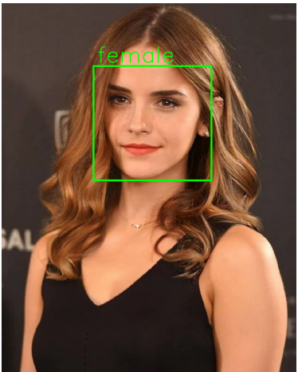
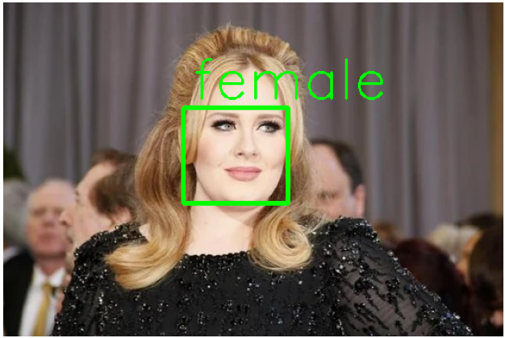
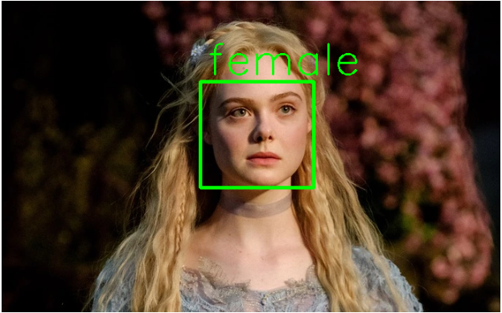
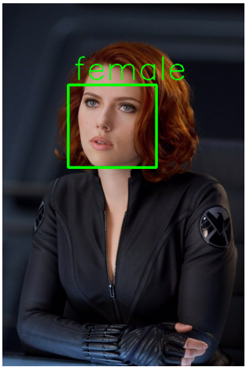
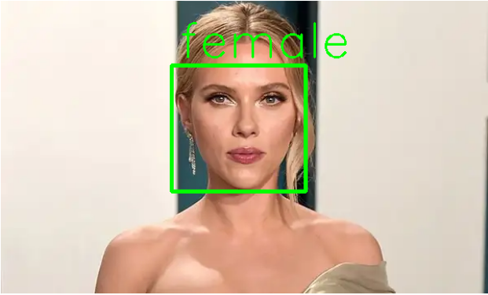
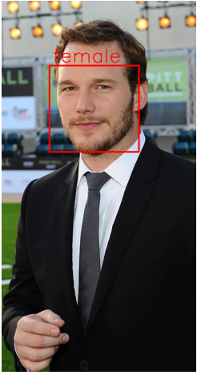
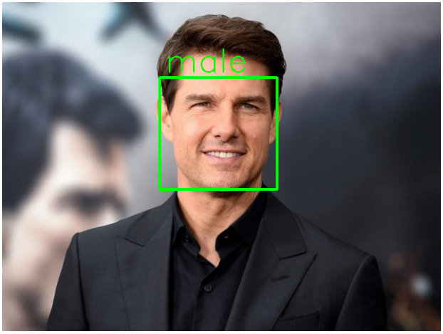
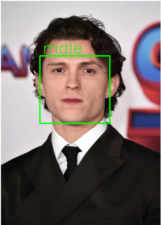
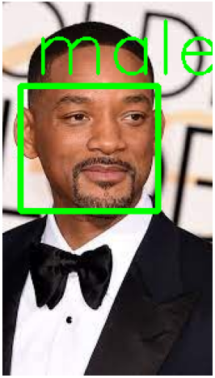
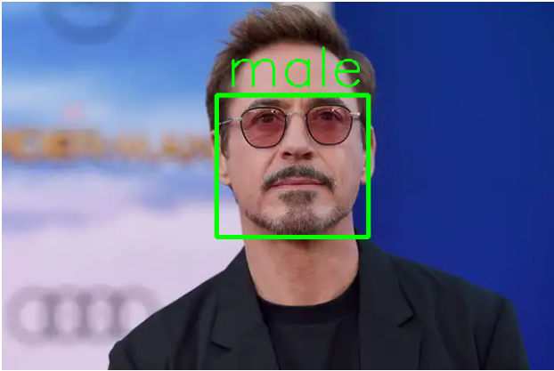

# Face-Recognition
Mô hình phát hiện giới tính thông qua hình ảnh khuôn mặt

Độ chính xác: 85.69%

## Kết quả chạy kiểm tra mô hình
### Phát hiện giới tính Nữ

### Phát hiện giới tính Nam

